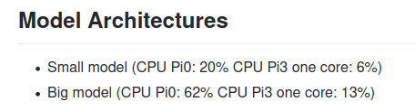

## Description
Mycroft wake word plugin for [Nyumaya](https://github.com/nyumaya)

DEPRECATED - you probably want [the latest](https://github.com/OpenVoiceOS/ovos-ww-plugin-nyumaya)

This uses the old [0.3.X nyumaya binaries](https://github.com/nyumaya/nyumaya_audio_recognition/tree/V0.3)



## Install

`pip install ovos_ww_plugin_nyumaya_legacy`

## Configuration

Add the following to your hotwords section in mycroft.conf 

```json
  "hotwords": {
    "alexa": {
        "module": "ovos_ww_plugin_nyumaya_legacy",
        "model": "alexa",
        "sensitivity": 0.5,
        "extractor_gain": 1.0
    },
    "alexa_big": {
        "module": "ovos_ww_plugin_nyumaya_legacy",
        "model": "alexa_big",
        "sensitivity": 0.5,
        "extractor_gain": 1.0
    },
    "marvin": {
        "module": "ovos_ww_plugin_nyumaya_legacy",
        "model": "marvin",
        "sensitivity": 0.5,
        "extractor_gain": 1.0
    },
    "marvin_big": {
        "module": "ovos_ww_plugin_nyumaya_legacy",
        "model": "marvin_big",
        "sensitivity": 0.5,
        "extractor_gain": 1.0
    },
    "sheila": {
        "module": "ovos_ww_plugin_nyumaya_legacy",
        "model": "sheila",
        "sensitivity": 0.5,
        "extractor_gain": 1.0
    },
     "sheila_big": {
        "module": "ovos_ww_plugin_nyumaya_legacy",
        "model": "sheila_big",
        "sensitivity": 0.5,
        "extractor_gain": 1.0
    }
  }
```

Then select what wakeword to use

```json
 "listener": {
      "wake_word": "alexa_big"
 }
 
```


# Training your own wake word

I could not find instructions to train your own wake-word, I opened an issue [here](https://github.com/nyumaya/nyumaya_audio_recognition/issues/25) requesting instructions